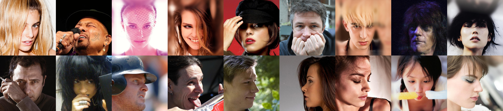
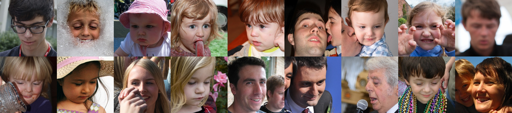

# Cleaned Face Datasets

TL;DR: The "cleaned" version of two popular face datasets, CelebAHQ and FFHQ, made by removing instances with extreme poses, occlusions, blurriness, or the presence of multiple individuals in the frame.

The [CelebA-HQ](https://github.com/tkarras/progressive_growing_of_gans) and [Flickr-Faces-HQ](https://github.com/NVlabs/ffhq-dataset) (FFHQ) datasets are popular face datasets, each consisting of 30k and 70k high-quality face images respectively. These images display a significant variation in terms of age, ethnicity, facial shape, expressions, poses, and lighting conditions. However, these datasets also contain instances with extreme poses, occlusions, blurriness, or the presence of multiple individuals in the frame. The removal of such images can contribute to enhancing the quality of the generated images. Below shows some examples of the those images. 

<p align="center"> 

</p>

<p align="center"> 

</p>

We have utilized a deep 3D face reconstruction model, [Deep3DFaceRecon](https://github.com/sicxu/Deep3DFaceRecon_pytorch), to identify these challenging cases. Certain images, where the model fitting failed to produce coefficients, were considered as hard cases. These images were subsequently excluded from the dataset, leaving us with `29,437` images from CelebA-HQ and `69,100` images from FFHQ. The list of images that were excluded can be found within the `docs` folder of this repository. 

We will provide widely used models of GANs and diffusion models, trained on the two "cleaned" datasets, accompanied by a quantitative comparison, to facillate further research.

## Citation

```bibtex

@article{xia2023retrofitting,
  title={Retrofitting 2D Latent Diffusion for 3D-Aware Face Image Generation},
  author={Xia, Weihao and Öztireli, Cengiz and Xue, Jing-Hao},
  year={2023},
}

@inproceedings{karras2017progressive,
  title={Progressive growing of gans for improved quality, stability, and variation},
  author={Karras, Tero and Aila, Timo and Laine, Samuli and Lehtinen, Jaakko},
  journal={International Conference on Learning Representations (ICLR)},
  year={2018}
}

@inproceedings{liu2015faceattributes,
  title = {Deep Learning Face Attributes in the Wild},
  author = {Liu, Ziwei and Luo, Ping and Wang, Xiaogang and Tang, Xiaoou},
  booktitle = {Proceedings of International Conference on Computer Vision (ICCV)},
  year = {2015} 
}
```